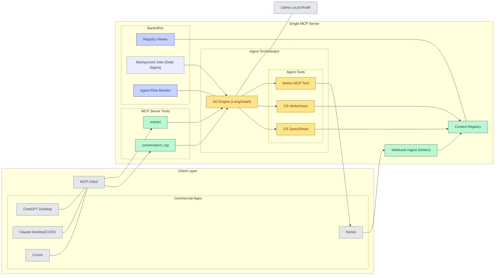

# AI Agent Orchestrator with Context Registry

---

## 팀원 소개

**팀명**: AI Agent Orchestrator Team (5명)  
**교육 프로그램**: Meta x Llama Academy 최종 프로젝트 (2025년 9월 30일 ~ 10월 2일)

### 팀원 및 역할
- **배승환님 : 기획자 역할 담당
  - 발표 문서 작성 및 발표

- **최현님 (🟡)**: AO (Agent Orchestrator) 영역 담당
  - LangGraph StateGraph 워크플로우 엔진 구현
  - Agent Tools (CR Query/Read, CR Write/Insert, Notion MCP Tool) 개발
  - LLaMA 모델 통합 (독립 모듈로 요약/분석 기능)

- **이지민님 · 이재범님 (🟢)**: MCP Server 영역 담당
  - MCP Server Tools 구현 (대화 로깅, 추출 도구)
  - Context Registry (CR) 구현 및 관리
  - Webhook Ingest 및 Notion 연동

- **황중원님 (🔵)**: Backoffice 영역 담당
  - Backoffice UI 개발 (Registry Viewer, Agent Flow Monitor)
  - Background Jobs 구현 (Daily Priority @07:00 KST)
  - 정책 및 접근 제어 설계

---

## 프로젝트 개요

본 프로젝트는 **MCP (Model Context Protocol)**와 **LangGraph**를 활용한 AI 에이전트 오케스트레이션 시스템입니다. 

여러 AI 클라이언트(ChatGPT Desktop, Claude Desktop/CODE, Cursor 등)에서 발생하는 대화 데이터를 수집·저장·분석하고, 이를 바탕으로 지능적인 인사이트를 제공하는 통합 플랫폼으로 설계되었습니다.

### 프로젝트 목표
- MCP 프로토콜을 통한 다중 AI 클라이언트 통합
- LangGraph 기반의 에이전트 워크플로우 구현
- 대화 컨텍스트의 영구 저장 및 효율적 검색
- 자동화된 일일 브리핑 및 인사이트 생성
- 웹 기반 관리 인터페이스 제공

---

## 주요 기능

### 1. **다중 AI 클라이언트 지원**
- ChatGPT Desktop, Claude Desktop/CODE, Gemini CLI, Cursor, Notion 등 다양한 AI 플랫폼 연동
- MCP 프로토콜을 통한 표준화된 통신 인터페이스

### 2. **실시간 대화 로깅 및 추출**
- `conversation_log`: 대화 데이터를 Context Registry에 자동 기록
- `extract`: 대화에서 핵심 정보 및 인사이트 추출

### 3. **Agent Orchestrator (LangGraph 기반)**
- **plan**: 요청 분석 및 처리 전략 수립
- **cr_read**: Context Registry에서 관련 컨텍스트 검색
- **summarize**: 대화 내용 요약 및 처리
- **cr_write**: 결과를 Context Registry에 저장

### 4. **Context Registry (영구 저장소)**
- SQLite 기반의 경량 데이터베이스
- 3개 주요 테이블:
  - `conversation`: 대화 메타데이터 및 내용 저장
  - `extract_result`: 추출된 결과 저장
  - `action_log`: 시스템 액션 및 작업 추적

### 5. **Backoffice 웹 인터페이스**
- Context Registry 데이터 조회 및 관리
- Background Job 스케줄링 및 모니터링
- Daily Digest (매일 07:00 KST 자동 실행)

### 6. **Notion 통합**
- Notion 페이지 스냅샷 관리
- Webhook을 통한 실시간 변경사항 수신
- PM 문서 자동 동기화

---

## 기술 스택 및 아키텍처

### 기술 스택

#### **Backend**
- **Python 3.10+**: 주요 개발 언어
- **FastAPI**: 웹 API 프레임워크
- **LangGraph**: 에이전트 워크플로우 엔진
- **SQLite**: 경량 데이터베이스
- **MCP (Model Context Protocol)**: AI 클라이언트 통신 표준

#### **AI & ML**
- **Ollama + LLaMA 3.2**: 로컬 LLM 실행
- **OpenAI API**: 대체 LLM 옵션
- **Hugging Face Transformers**: 모델 로딩 및 추론

#### **Frontend**
- **Jinja2**: 템플릿 엔진
- **HTML/CSS/JavaScript**: Backoffice UI

#### **DevOps & Tools**
- **uv**: Python 패키지 관리자
- **APScheduler**: 백그라운드 작업 스케줄링
- **aiohttp**: 비동기 HTTP 클라이언트

### 아키텍처



### 데이터 플로우

1. **Client Request**: AI 클라이언트가 MCP를 통해 대화 데이터 전송
2. **MCP Routing**: MCP Server가 요청을 적절한 도구 핸들러로 라우팅
3. **Agent Processing**: LangGraph orchestrator가 상태 노드를 통해 처리
4. **Context Storage**: 결과를 Context Registry에 저장
5. **Backoffice Access**: 웹 인터페이스를 통해 데이터 조회 및 관리

---

## 실행 방법

### 사전 준비

#### 1. uv 설치
```bash
# Windows (PowerShell)
powershell -ExecutionPolicy ByPass -c "irm https://astral.sh/uv/install.ps1 | iex"

# Linux/macOS
curl -LsSf https://astral.sh/uv/install.sh | sh
```

#### 2. 의존성 설치
```bash
cd projects/ai-agent-orchestrator-team
uv sync
```

#### 3. Ollama + LLaMA 설정 (선택사항)
```bash
# Ollama 설치 (Linux/WSL)
curl -fsSL https://ollama.ai/install.sh | sh

# LLaMA 모델 다운로드
ollama pull llama3.2:1b

# 서버 시작
ollama serve
```

### 데모 실행

#### 방법 1: 통합 스크립트 (권장)
```bash
uv run python start_demo.py
```

#### 방법 2: 개별 컴포넌트 실행
```bash
# 터미널 1: Context Registry
uv run python context_registry/registry.py

# 터미널 2: Agent Orchestrator
uv run python agent_orchestrator/orchestrator.py

# 터미널 3: MCP Server
uv run python mcp_server/server.py

# 터미널 4: Backoffice UI
uv run python backoffice/app.py
```

### 서비스 URL

실행 후 다음 URL에서 각 서비스에 접근할 수 있습니다:

- **Backoffice UI**: http://localhost:8003
- **Agent Orchestrator**: http://localhost:8001
- **Context Registry**: http://localhost:8002
- **MCP Server**: stdio (클라이언트 연결용)

### AI 클라이언트 설정

Cursor 또는 Claude Desktop 설정 파일에 다음 내용을 추가하세요:

```json
{
  "mcpServers": {
    "ai-agent-orchestrator": {
      "command": "uv",
      "args": ["run", "python", "mcp_server/server.py"],
      "env": {}
    }
  }
}
```

설정 파일 위치:
- **Cursor**: `client_configs/cursor.json` 참고
- **Claude Desktop**: `client_configs/claude_desktop.json` 참고

---

## 프로젝트 구조

```
projects/ai-agent-orchestrator-team/
├── agent_orchestrator/     # LangGraph StateGraph 로직 (🟡)
│   ├── orchestrator.py     # 메인 오케스트레이터
│   ├── llm_provider.py     # LLM 통합
│   ├── summarizer.py       # 요약 기능
│   └── daily_briefing.py   # 일일 브리핑
├── mcp_server/             # MCP 구현 (🟢)
│   ├── server.py           # MCP 서버
│   ├── gmail_mcp_client.py # Gmail 연동
│   ├── slack_mcp_client.py # Slack 연동
│   └── notion_mcp_client.py# Notion 연동
├── context_registry/       # Context Registry (🟢)
│   ├── registry.py         # 메인 레지스트리
│   └── registry_fix.py     # 데이터 정합성 도구
├── backoffice/             # 웹 UI (🔵)
│   ├── app.py              # FastAPI 앱
│   ├── job_manager.py      # 작업 관리자
│   ├── templates/          # HTML 템플릿
│   └── static/             # 정적 파일
├── client_configs/         # AI 클라이언트 설정
├── docs/                   # 문서
├── scripts/                # 개발 유틸리티
├── pyproject.toml          # 프로젝트 설정
├── start_demo.py           # 데모 시작 스크립트
└── README.md               # 본 문서
```

---

## 개발 가이드

### 개발 명령어

```bash
# 데모 시작
python scripts/dev.py demo

# 코드 린팅
python scripts/dev.py lint

# 테스트 실행
python scripts/dev.py test

# 빌드 아티팩트 정리
python scripts/dev.py clean
```

### Git 워크플로우

1. **Feature 브랜치 생성**
   ```bash
   git checkout -b feature/member-name/feature-description
   ```

2. **변경사항 커밋**
   ```bash
   git add .
   git commit -m "feat: Add new feature"
   ```

3. **Pull Request 생성**
   - 코드 리뷰 요청
   - 최소 1명 이상 승인 필요

---

## 평가 기준 (Meta Llama Academy)

본 프로젝트는 다음 기준에 따라 평가됩니다:

- **Project Impact (20점)**: MCP를 활용한 실용적 솔루션
- **Innovation & Creativity (20점)**: LangGraph 기반 혁신적 워크플로우
- **Technical Implementation (25점)**: 시스템 완성도 및 안정성
- **Effective Use of AI (25점)**: LLaMA 모델의 효과적 활용
- **Presentation & Documentation (10점)**: 명확한 아키텍처 설명

---

## 참고 자료

- [MCP Specification](https://modelcontextprotocol.io/) - Model Context Protocol 공식 문서
- [LangGraph Documentation](https://python.langchain.com/docs/langgraph) - LangGraph 공식 문서
- [Meta Llama Academy](https://llamaacademy.kr/) - Workshop 정보
- [Ollama](https://ollama.ai/) - 로컬 LLM 실행 환경
- [FastAPI](https://fastapi.tiangolo.com/) - 웹 프레임워크 문서

---

## 라이선스

MIT License - 자세한 내용은 LICENSE 파일을 참조하세요.

---

**프로젝트**: Meta x Llama Academy 최종 프로젝트  
**팀명**: AI Agent Orchestrator Team  
**기간**: 2025년 9월 30일 ~ 10월 2일
