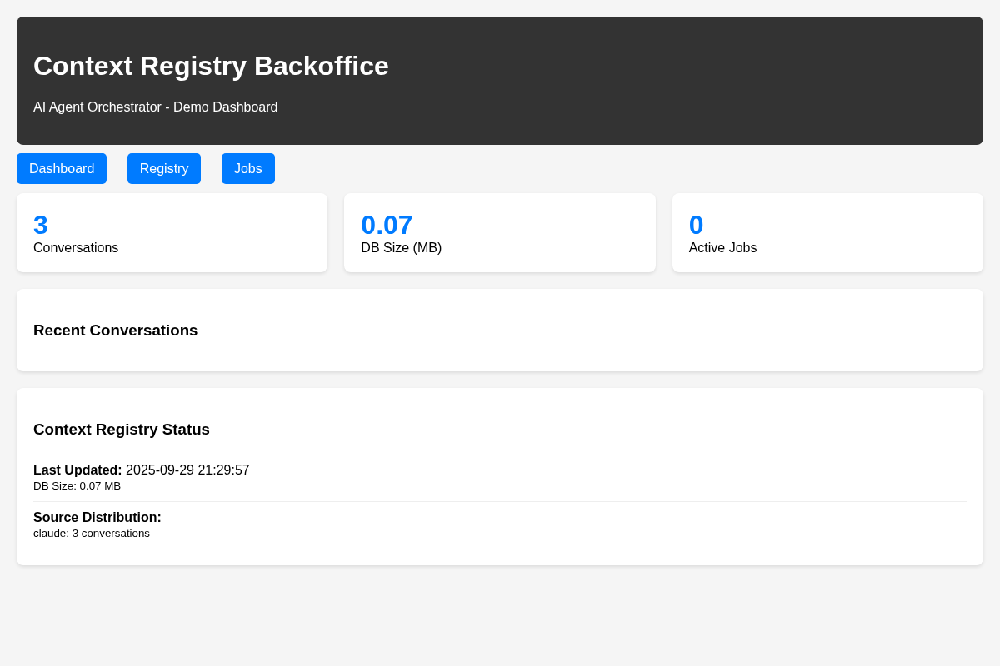
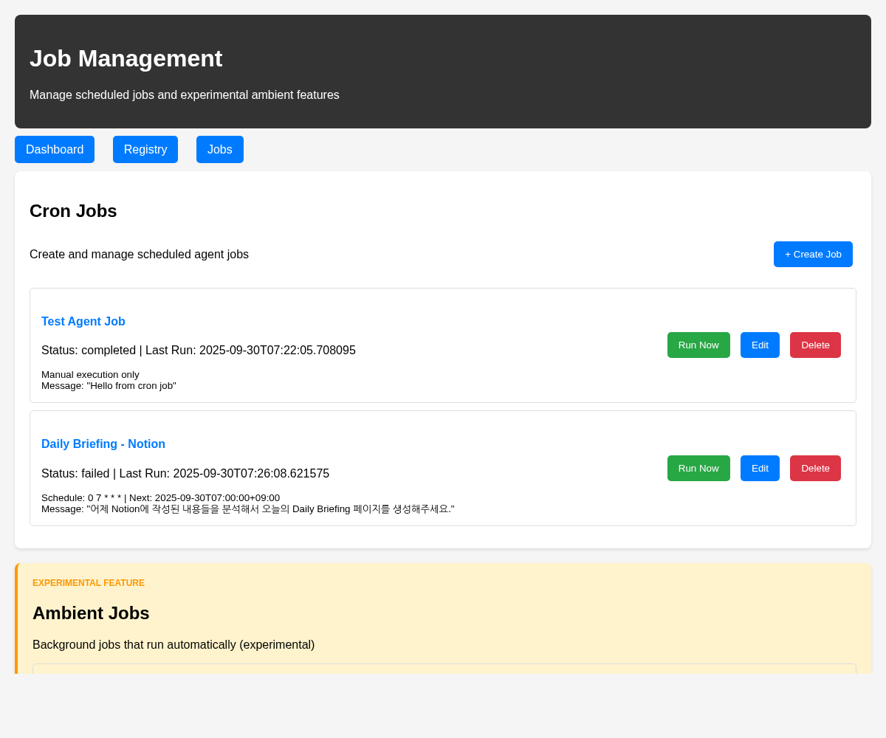

# Backoffice 구현 현황

**AI Agent Orchestrator 백오피스 관리 시스템 구현 완료**

---

## 📋 지원 시나리오

### 1. Daily Briefing 자동화
**설명**: 매일 정해진 시간에 Notion, Slack, Gmail 등의 정보를 수집하여 LLaMA 모델로 분석 후 Daily Briefing 페이지를 자동 생성

**Backoffice 동작**:
- `agent` 타입 Job으로 매일 07:00 KST 자동 실행
- 프롬프트를 넘겨 Agent Orchestrator를 실행

### 2. Context 공유 (Cursor↔Claude)
**설명**: Cursor에서 진행한 코딩 대화를 Claude Desktop에서 검색하고 연속하여 작업할 수 있는 크로스 플랫폼 컨텍스트 연속성

**Backoffice 동작**:
- Context Registry를 통해 대화 저장/조회 관리
- 채널별 대화 세션 모니터링 및 통계 제공

### 3. Ambient Jobs (실험적 기능)
**설명**: 백그라운드에서 자동으로 실행되는 Knowledge Cards(이전 나눈 대화 기반 새로운 지식습득을 위해 퀴즈나 암기 카드 생성) 생성 등의 주변 정보 처리 작업

**Backoffice 동작**:
- `ambient` 타입 Job으로 백그라운드 자동 실행
- 설정된 스케줄에 따라 Context Registry 데이터 분석
- Knowledge Cards 생성 결과를 실행 이력에 자동 기록

---

## 🎯 핵심 구현 기능

### Job 스케줄링 및 실행 관리
- ✅ **Cron Job 스케줄링**: 시간 기반 자동 실행 (예: 매일 07:00)
- ✅ **Agent 타입 Job**: Agent Orchestrator와 연동한 워크플로우 실행
- ✅ **Ambient 타입 Job**: 백그라운드 자동 실행 작업 지원
- ✅ **수동 실행**: "Run Now" 버튼으로 즉시 실행 테스트 가능

### 모니터링 및 관리
- ✅ **실행 이력 추적**: 성공/실패 상태, 소요시간, 에러 메시지 기록
- ✅ **Context Registry 연동**: MCP 프로토콜 기반 대화 저장/조회
- ✅ **Dashboard**: 시스템 상태 및 통계 정보 제공
- ✅ **Job CRUD**: 작업 생성, 수정, 삭제 관리

---

## 🏗️ 백오피스 UI 구현 현황

**완전한 웹 기반 관리 시스템:**
- ✅ **Cron Job 스케줄링**: 시간 기반 자동 실행 관리
- ✅ **Agent Orchestrator 연동**: LangGraph 워크플로우 실행
- ✅ **실행 모니터링**: 상세한 실행 이력 및 에러 추적
- ✅ **MCP 서버 통합**: Context Registry와 연동한 대화 관리

### 1. Dashboard
- Context Registry 통계 (대화 수, DB 크기)
- 활성 Job 수 및 시스템 상태 표시

### 2. Jobs 관리
- **Agent 타입 Job**: Agent Orchestrator 워크플로우 실행
- **Ambient 타입 Job**: 백그라운드 자동 실행 작업
- **스케줄 설정**: Cron 표현식으로 실행 시간 관리
- **즉시 실행**: "Run Now" 버튼으로 테스트 가능
- **CRUD 관리**: 작업 생성, 수정, 삭제 지원

### 3. 실행 이력
- Job 이름 클릭 → 실행 이력 페이지 이동
- 실행 시간, 소요시간, 상태 (성공/실패) 표시
- 에러 메시지 및 결과 상세 보기 (Collapsible)
- Notion 페이지 URL 확인

### 4. Context Registry 연동
- **MCP 서버 기반**: 대화 저장/조회 API 제공
- **conversation_log**: AI 플랫폼 대화 자동 저장
- **extract**: 특정 주제/키워드 대화 검색 및 조회
- **채널 관리**: 세션별 대화 구분 및 관리
- **크로스 플랫폼**: Cursor, Claude Desktop 등 다양한 AI 클라이언트 지원

---

## 🎯 구현 완료 현황

**AI Agent Orchestrator 백오피스 시스템 100% 구현 완료**

### 핵심 기능
- **Job 스케줄링**: Cron 기반 자동 실행 관리
- **워크플로우 실행**: Agent/Ambient 타입별 작업 처리
- **실행 모니터링**: 상세한 이력 추적 및 에러 관리
- **MCP 통합**: Context Registry 연동으로 대화 관리

### 기술 스택
- **Backend**: FastAPI, SQLite, APScheduler
- **Frontend**: Bootstrap, Jinja2 템플릿
- **통합**: Agent Orchestrator, Context Registry

**완전한 관리 시스템으로 즉시 운영 가능합니다.**