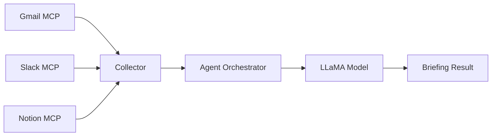

# 통합 데이터 스키마 명세서

> **작성일**: 2025-09-29
> **목적**: Daily Briefing 시나리오를 위한 데이터 구조 표준화

---

## 📋 목차

1. [개요](#1-개요)
2. [전체 데이터 플로우](#2-전체-데이터-플로우)
3. [Collector 최상위 출력 스키마](#3-collector-최상위-출력-스키마)
4. [Gmail 데이터 스키마](#4-gmail-데이터-스키마)
5. [Slack 데이터 스키마](#5-slack-데이터-스키마)
6. [Notion 데이터 스키마](#6-notion-데이터-스키마)
7. [Agent Orchestrator 입력 형식](#7-agent-orchestrator-입력-형식)
8. [사용 예시](#8-사용-예시)
9. [에러 처리](#9-에러-처리)

---

## 1. 개요

### 문서 목적

이 문서는 Daily Briefing 데이터 수집 과정에서 사용되는 데이터 구조를 정의합니다.

### 데이터 흐름

```
External MCP Servers → MCP Clients → Collector → Agent Orchestrator → LLaMA
```

---

## 2. 전체 데이터 플로우



### 각 단계별 데이터 형태

1. **External MCP → MCP Client**: 서비스별 원본 형식 (JSON, CSV 등)
2. **MCP Client → Collector**: 정규화된 Python Dict
3. **Collector → Agent Orchestrator**: 통합 스키마 (본 문서)
4. **Agent Orchestrator → LLaMA**: 텍스트 프롬프트

---

## 3. Collector 최상위 출력 스키마

### 함수 시그니처

```python
# mcp_server/daily_briefing_collector.py
async def collect_daily_briefing_data(
    hours: int = 24,
    notion_database_id: Optional[str] = None
) -> Dict[str, Any]:
```

### 출력 구조

```python
{
    # 메타데이터
    "timestamp": "2025-09-29T07:00:00+09:00",  # ISO 8601 형식
    "period_hours": 24,                         # 수집 기간 (시간)

    # 수집된 데이터
    "data": {
        "gmail": {
            "emails": [...],      # 이메일 배열 (아래 참조)
            "count": 5,           # 이메일 개수
            "status": "success",  # "success" | "error" | "skipped"
            "error": None         # 에러 메시지 (있으면 문자열)
        },
        "slack": {
            "mentions": [...],    # 멘션 배열 (아래 참조)
            "dms": [...],         # DM 배열 (아래 참조)
            "count": 8,           # mentions + dms 합계
            "status": "success",
            "error": None
        },
        "notion": {
            "tasks": [...],       # 태스크 배열 (아래 참조)
            "count": 12,          # 태스크 개수
            "status": "success",
            "error": None
        }
    },

    # 수집 요약
    "summary": {
        "total_sources": 3,           # 전체 소스 개수
        "successful_sources": 2,      # 성공한 소스 개수
        "failed_sources": 1           # 실패한 소스 개수
    }
}
```

### 필드 설명

| 필드 | 타입 | 필수 | 설명 |
|------|------|------|------|
| `timestamp` | string | ✅ | 수집 시작 시간 (ISO 8601) |
| `period_hours` | integer | ✅ | 조회 기간 (시간 단위) |
| `data` | object | ✅ | 서비스별 수집 데이터 |
| `summary` | object | ✅ | 수집 결과 요약 |

### 구현 위치

- 파일: [mcp_server/daily_briefing_collector.py](../mcp_server/daily_briefing_collector.py)
- 함수: `collect_daily_briefing_data()` (27-116번 줄)
- 반환 구조: 79-88번 줄

---

## 4. Gmail 데이터 스키마

### 데이터 구조

```python
# data["gmail"]
{
    "emails": [
        {
            "id": "1999b6fbc1884a7e",                    # Gmail 메시지 ID
            "threadId": "1999b6fbc1884a7e",              # 스레드 ID
            "snippet": "This is a preview text...",      # 미리보기 (50자)
            "subject": "긴급: 프로젝트 승인 요청",         # 제목
            "from": "Manager <manager@company.com>",     # 발신자 (이름 + 이메일)
            "date": "Tue, 30 Sep 2025 16:23:34 GMT",    # 날짜 (RFC 2822)
            "body": "전체 이메일 본문 내용...\n\n감사합니다."  # 본문 (HTML 제거됨)
        }
    ],
    "count": 5,
    "status": "success",
    "error": None
}
```

### 필드 상세 설명

| 필드 | 타입 | 예시 | 설명 |
|------|------|------|------|
| `id` | string | "1999b6fbc1884a7e" | Gmail 메시지 고유 ID |
| `threadId` | string | "1999b6fbc1884a7e" | 대화 스레드 ID (같은 주제 묶음) |
| `snippet` | string | "This is a preview..." | Gmail이 자동 생성한 미리보기 |
| `subject` | string | "긴급: 프로젝트 승인" | 이메일 제목 |
| `from` | string | "Manager <email@...>" | 발신자 (이름과 이메일 포함) |
| `date` | string | "Tue, 30 Sep 2025..." | 수신 날짜 (RFC 2822 형식) |
| `body` | string | "본문 내용..." | 이메일 본문 (HTML 태그 제거됨) |

### Body 필드 처리

이메일 본문은 다음 처리를 거칩니다:

```python
# mcp_server/gmail_mcp_client.py (234-298번 줄)
def _clean_email_body(self, body: str) -> str:
    """
    HTML 제거 및 텍스트 정규화:
    1. HTML 주석 제거
    2. <script>, <style> 태그 제거
    3. HTML 태그 제거 (줄바꿈 구조 유지)
    4. HTML 엔티티 디코딩 (&nbsp; → 공백)
    5. 줄바꿈 정규화 (\r\n → \n)
    6. 과도한 빈 줄 제거 (3+ → 2)
    7. 공백 정규화
    """
```

**처리 전 (HTML)**:
```html
<div>
  <p>안녕하세요,&nbsp;<strong>프로젝트</strong>&nbsp;승인 요청드립니다.</p>
  <br><br><br>
  <p>감사합니다.</p>
</div>
```

**처리 후 (Plain Text)**:
```
안녕하세요, 프로젝트 승인 요청드립니다.

감사합니다.
```

### 수집 로직

```python
# mcp_server/gmail_mcp_client.py (369-421번 줄)
async def fetch_urgent_emails(self, hours: int = 24, include_body: bool = True):
    """
    긴급 이메일 조회:
    - 조건: (is:important OR is:unread) AND after:YYYY/MM/DD
    - 최대: 50개
    - 본문: include_body=True 시 전체 본문 조회
    """
```

### 구현 위치

- 파일: [mcp_server/gmail_mcp_client.py](../mcp_server/gmail_mcp_client.py)
- 수집 함수: `fetch_urgent_emails()` (369-421번 줄)
- 본문 정리: `_clean_email_body()` (234-298번 줄)
- Collector 호출: [daily_briefing_collector.py:119-142](../mcp_server/daily_briefing_collector.py#L119-L142)

---

## 5. Slack 데이터 스키마

### 데이터 구조

```python
# data["slack"]
{
    "mentions": [
        {
            "ts": "1696012345.123456",                  # Slack 타임스탬프
            "user": "U01234567",                        # 발신자 사용자 ID
            "text": "@username 코드 리뷰 부탁드립니다",   # 메시지 텍스트
            "type": "message",                          # 메시지 타입
            "channel": "C01234567",                     # 채널 ID
            "channel_name": "dev-team",                 # 채널 이름 (#제외)
            "permalink": "https://workspace.slack.com/archives/...",
            "timestamp": "1696012345.123456"            # ts와 동일
        }
    ],
    "dms": [
        # 현재는 빈 배열 (향후 구현 예정)
    ],
    "count": 8,           # mentions + dms 합계
    "status": "success",
    "error": None
}
```

### 필드 상세 설명

| 필드 | 타입 | 예시 | 설명 |
|------|------|------|------|
| `ts` | string | "1696012345.123456" | Slack 타임스탬프 (유닉스 시간 + 소수점) |
| `user` | string | "U01234567" | 발신자 Slack 사용자 ID |
| `text` | string | "@username 안녕하세요" | 메시지 전체 텍스트 |
| `type` | string | "message" | 메시지 타입 (보통 "message") |
| `channel` | string | "C01234567" | 채널 고유 ID |
| `channel_name` | string | "dev-team" | 채널 표시 이름 (# 제외) |
| `permalink` | string | "https://..." | 메시지 링크 (웹에서 바로 열기) |
| `timestamp` | string | "1696012345.123456" | ts 필드와 동일 (중복) |

### 타임스탬프 변환

Slack 타임스탬프를 일반 날짜로 변환하려면:

```python
import datetime

ts = "1696012345.123456"
dt = datetime.datetime.fromtimestamp(float(ts))
# 2023-09-29 21:45:45.123456
```

### 수집 로직

```python
# mcp_server/slack_mcp_client.py (292-324번 줄)
async def fetch_recent_mentions_and_dms(self, hours: int = 24):
    """
    최근 멘션 및 DM 조회:
    - Mentions: "@me after:@{timestamp}" 쿼리로 검색
    - DMs: 현재는 placeholder (향후 구현)
    - 최대: 50개
    """
```

### CSV 파싱

Slack MCP 서버는 CSV 형식으로 응답합니다:

```csv
Timestamp,User,Text,Type,Channel,ChannelName,Permalink
1696012345.123456,U01234567,"@username 코드 리뷰",message,C01234567,dev-team,https://...
```

이를 Python Dict로 자동 변환:

```python
# mcp_server/slack_mcp_client.py (239-241번 줄)
messages = list(csv.DictReader(io.StringIO(content)))
```

### 구현 위치

- 파일: [mcp_server/slack_mcp_client.py](../mcp_server/slack_mcp_client.py)
- 수집 함수: `fetch_recent_mentions_and_dms()` (292-324번 줄)
- 메시지 파싱: `_parse_message()` (326-349번 줄)
- Collector 호출: [daily_briefing_collector.py:145-172](../mcp_server/daily_briefing_collector.py#L145-L172)

---

## 6. Notion 데이터 스키마

### 데이터 구조

```python
# data["notion"]
{
    "tasks": [
        {
            "id": "abc123-def456-ghi789-...",           # Notion 페이지 ID (UUID)
            "title": "API 문서 업데이트",                 # 태스크 제목
            "status": "In Progress",                    # 상태 (Done 제외)
            "priority": "High",                         # 우선순위
            "due_date": "2025-09-29",                   # 마감일 (없으면 None)
            "url": "https://notion.so/workspace/...",  # Notion 페이지 URL
            "created_time": "2025-09-20T10:30:00.000Z",     # 생성 시간 (ISO 8601)
            "last_edited_time": "2025-09-28T14:22:00.000Z"  # 마지막 수정 시간
        }
    ],
    "count": 12,
    "status": "success",
    "error": None
}
```

### 필드 상세 설명

| 필드 | 타입 | 예시 | 설명 |
|------|------|------|------|
| `id` | string | "abc123-def456-..." | Notion 페이지 고유 ID (UUID 형식) |
| `title` | string | "API 문서 업데이트" | 태스크 제목 (Name 속성) |
| `status` | string | "In Progress" | 상태 ("Not Started", "In Progress", "Done" 등) |
| `priority` | string | "High" | 우선순위 ("High", "Medium", "Low") |
| `due_date` | string\|null | "2025-09-29" | 마감일 (YYYY-MM-DD, 없으면 None) |
| `url` | string | "https://notion.so/..." | Notion에서 페이지 열기 링크 |
| `created_time` | string | "2025-09-20T10:30:00Z" | 페이지 생성 시간 (UTC) |
| `last_edited_time` | string | "2025-09-28T14:22:00Z" | 마지막 수정 시간 (UTC) |

### 필터 및 정렬 조건

```python
# mcp_server/notion_mcp_client.py (236-248번 줄)

# 필터: Status != "Done"
filter_obj = {
    "property": "Status",
    "status": {
        "does_not_equal": "Done"
    }
}

# 정렬: Priority 오름차순 (High → Medium → Low)
sorts = [
    {
        "property": "Priority",
        "direction": "ascending"
    }
]
```

### Notion 속성 파싱

Notion API는 복잡한 JSON 구조를 반환합니다:

```python
# 원본 Notion API 응답
{
    "properties": {
        "Name": {
            "type": "title",
            "title": [
                {"plain_text": "API 문서 업데이트"}
            ]
        },
        "Status": {
            "type": "status",
            "status": {
                "name": "In Progress"
            }
        },
        "Priority": {
            "type": "select",
            "select": {
                "name": "High"
            }
        }
    }
}
```

이를 단순화:

```python
# mcp_server/notion_mcp_client.py (316-373번 줄)
def _parse_task_page(self, page: Dict[str, Any]) -> Optional[Dict[str, Any]]:
    """
    복잡한 Notion 구조를 평탄화:
    - properties.Name.title[0].plain_text → title
    - properties.Status.status.name → status
    - properties.Priority.select.name → priority
    """
```

### 구현 위치

- 파일: [mcp_server/notion_mcp_client.py](../mcp_server/notion_mcp_client.py)
- 수집 함수: `fetch_pending_tasks()` (224-264번 줄)
- 페이지 파싱: `_parse_task_page()` (316-373번 줄)
- Collector 호출: [daily_briefing_collector.py:175-209](../mcp_server/daily_briefing_collector.py#L175-L209)

---

## 7. Agent Orchestrator 입력 형식

### 전달되는 데이터 구조

Agent Orchestrator의 `process_request()` 함수로 전달되는 형태:

```python
# agent_orchestrator/orchestrator.py
await orchestrator.process_request(
    request_type="daily_briefing",
    content={
        "operation": "daily_briefing",
        "trigger_time": "2025-09-29T07:00:00+09:00",
        "source": "backoffice_scheduler",

        # 위의 Collector 출력 전체가 여기 들어감
        "collected_data": {
            "timestamp": "2025-09-29T07:00:00+09:00",
            "period_hours": 24,
            "data": {
                "gmail": { ... },
                "slack": { ... },
                "notion": { ... }
            },
            "summary": { ... }
        }
    }
)
```

### StateGraph State 구조

```python
# agent_orchestrator/orchestrator.py (58-71번 줄)
class AgentState(TypedDict):
    request_type: str                     # "daily_briefing"
    content: Dict[str, Any]               # 위의 전체 데이터

    # 처리 과정
    plan: Optional[Dict[str, Any]]
    context_data: Optional[Dict[str, Any]]
    summary_result: Optional[Dict[str, Any]]

    # 출력
    final_result: Optional[Dict[str, Any]]
    error: Optional[str]
```

### 데이터 접근 예시

```python
# transform 노드에서 데이터 접근
async def _transform_node(self, state: AgentState) -> AgentState:
    # 1. 전체 수집 데이터 가져오기
    collected = state["content"]["collected_data"]

    # 2. 서비스별 데이터 추출
    gmail_data = collected["data"]["gmail"]
    slack_data = collected["data"]["slack"]
    notion_data = collected["data"]["notion"]

    # 3. 개별 항목 접근
    for email in gmail_data["emails"]:
        subject = email["subject"]
        from_addr = email["from"]
        body = email["body"]

    for mention in slack_data["mentions"]:
        text = mention["text"]
        channel = mention["channel_name"]

    for task in notion_data["tasks"]:
        title = task["title"]
        priority = task["priority"]
        due = task["due_date"]
```

---

## 8. 사용 예시

### 예시 1: LLaMA 프롬프트 생성

```python
# agent_orchestrator/orchestrator.py의 transform 노드

async def _transform_node(self, state: AgentState) -> AgentState:
    """LLaMA로 브리핑 생성"""

    collected = state["content"]["collected_data"]
    gmail_data = collected["data"]["gmail"]
    slack_data = collected["data"]["slack"]
    notion_data = collected["data"]["notion"]

    # LLaMA 프롬프트 구성
    prompt = f"""
다음 업무 데이터를 분석하여 데일리 브리핑을 생성해주세요:

## 📧 Gmail ({gmail_data['count']}개 긴급 이메일)
"""

    # 이메일 요약
    for i, email in enumerate(gmail_data["emails"][:5], 1):
        prompt += f"""
{i}. 제목: {email['subject']}
   발신: {email['from']}
   날짜: {email['date']}
   내용: {email['body'][:200]}...
"""

    prompt += f"""

## 💬 Slack ({slack_data['count']}개 멘션/메시지)
"""

    # 멘션 요약
    for i, mention in enumerate(slack_data["mentions"][:5], 1):
        prompt += f"""
{i}. 채널: #{mention['channel_name']}
   내용: {mention['text']}
"""

    prompt += f"""

## ✓ Notion ({notion_data['count']}개 미완료 태스크)
"""

    # 태스크 요약
    for i, task in enumerate(notion_data["tasks"][:10], 1):
        due_str = f" (마감: {task['due_date']})" if task['due_date'] else ""
        prompt += f"""
{i}. [{task['priority']}] {task['title']}{due_str}
   상태: {task['status']}
"""

    prompt += """

분석 기준:
1. 긴급도: 오늘 마감, 중요 이메일 우선
2. 중요도: High priority 태스크 우선
3. 연관성: 같은 프로젝트/주제 그룹핑

출력 형식:
🔥 긴급 처리 항목 (Top 3)
- [출처] 항목명 - 이유

⭐ 중요 업무 (Top 5)
- [출처] 항목명 - 설명

📋 팀 관련 업데이트
- 채널/프로젝트별 요약
"""

    # LLaMA 모델 호출
    analysis_result = await llama_model.generate(prompt)

    state["summary_result"] = {
        "type": "daily_briefing",
        "briefing_text": analysis_result,
        "source_counts": {
            "gmail": gmail_data["count"],
            "slack": slack_data["count"],
            "notion": notion_data["count"]
        }
    }

    return state
```

### 예시 2: 긴급도 판단 로직

```python
def calculate_urgency_score(email: Dict, task: Dict, mention: Dict) -> Dict:
    """
    각 항목의 긴급도 점수 계산
    """
    scores = {}

    # Gmail 긴급도 (0-10)
    score = 0
    if "긴급" in email.get("subject", ""):
        score += 5
    if "urgent" in email.get("subject", "").lower():
        score += 5
    if len(email.get("body", "")) > 500:  # 긴 이메일 = 중요
        score += 2
    scores["email"] = min(score, 10)

    # Notion 긴급도 (0-10)
    score = 0
    if task.get("priority") == "High":
        score += 5
    if task.get("due_date"):
        # D-day 계산
        from datetime import datetime, timedelta
        due = datetime.fromisoformat(task["due_date"])
        days_left = (due - datetime.now()).days
        if days_left == 0:
            score += 5  # 오늘 마감
        elif days_left == 1:
            score += 3  # 내일 마감
        elif days_left <= 3:
            score += 1  # 3일 이내
    scores["task"] = min(score, 10)

    # Slack 긴급도 (0-10)
    score = 0
    if "@channel" in mention.get("text", ""):
        score += 3
    if "긴급" in mention.get("text", ""):
        score += 4
    scores["mention"] = min(score, 10)

    return scores
```

### 예시 3: 에러 처리

```python
async def collect_with_fallback():
    """
    일부 서비스 실패 시에도 계속 진행
    """
    result = await collect_daily_briefing_data(hours=24)

    # 성공한 데이터만 처리
    available_data = []

    if result["data"]["gmail"]["status"] == "success":
        available_data.append("Gmail")
    else:
        logger.warning(f"Gmail 수집 실패: {result['data']['gmail']['error']}")

    if result["data"]["slack"]["status"] == "success":
        available_data.append("Slack")
    else:
        logger.warning(f"Slack 수집 실패: {result['data']['slack']['error']}")

    if result["data"]["notion"]["status"] == "success":
        available_data.append("Notion")
    else:
        logger.warning(f"Notion 수집 실패: {result['data']['notion']['error']}")

    # 최소 1개 이상 성공해야 브리핑 생성
    if len(available_data) == 0:
        raise Exception("모든 데이터 소스 수집 실패")

    logger.info(f"브리핑 생성 가능: {', '.join(available_data)} 데이터 사용")
    return result
```

---

## 9. 에러 처리

### Status 필드 값

각 서비스의 `status` 필드는 다음 값을 가질 수 있습니다:

| Status | 의미 | error 필드 | count 필드 |
|--------|------|-----------|-----------|
| `"success"` | 정상 수집 완료 | `None` | 실제 개수 |
| `"error"` | 수집 중 에러 발생 | 에러 메시지 문자열 | `0` |
| `"skipped"` | 의도적으로 생략됨 | 생략 이유 | `0` |

### 에러 발생 시 구조

```python
# Gmail 수집 실패 예시
{
    "data": {
        "gmail": {
            "emails": [],  # 빈 배열
            "count": 0,
            "status": "error",
            "error": "Authentication failed: Invalid credentials"
        },
        "slack": {
            "mentions": [...],  # 정상 수집됨
            "dms": [],
            "count": 5,
            "status": "success",
            "error": None
        },
        "notion": {
            "tasks": [],
            "count": 0,
            "status": "skipped",
            "error": "No database ID provided"
        }
    },
    "summary": {
        "total_sources": 3,
        "successful_sources": 1,  # Slack만 성공
        "failed_sources": 2       # Gmail error, Notion skipped
    }
}
```

### 에러 처리 권장 사항

```python
# Agent Orchestrator에서 권장하는 에러 처리

def validate_collected_data(collected: Dict) -> bool:
    """수집된 데이터가 브리핑 생성에 충분한지 검증"""

    summary = collected["summary"]

    # 1. 최소 1개 이상 성공
    if summary["successful_sources"] == 0:
        logger.error("모든 데이터 소스 수집 실패")
        return False

    # 2. 최소 데이터 개수 확인
    total_items = 0
    for service in ["gmail", "slack", "notion"]:
        total_items += collected["data"][service]["count"]

    if total_items < 3:
        logger.warning(f"수집된 항목이 너무 적음: {total_items}개")
        # 브리핑은 생성하되 경고 메시지 포함

    return True

# 사용 예시
collected = await collect_daily_briefing_data()

if not validate_collected_data(collected):
    # 실패 처리
    raise Exception("브리핑 생성 불가: 데이터 부족")

# 정상 진행
await orchestrator.process_request("daily_briefing", {
    "collected_data": collected
})
```

---

## 📚 참고 자료

### 관련 파일

| 파일 | 역할 | 주요 함수 |
|------|------|----------|
| [mcp_server/daily_briefing_collector.py](../mcp_server/daily_briefing_collector.py) | 데이터 수집 통합 | `collect_daily_briefing_data()` |
| [mcp_server/gmail_mcp_client.py](../mcp_server/gmail_mcp_client.py) | Gmail 데이터 수집 | `fetch_urgent_emails()` |
| [mcp_server/slack_mcp_client.py](../mcp_server/slack_mcp_client.py) | Slack 데이터 수집 | `fetch_recent_mentions_and_dms()` |
| [mcp_server/notion_mcp_client.py](../mcp_server/notion_mcp_client.py) | Notion 데이터 수집 | `fetch_pending_tasks()` |
| [agent_orchestrator/orchestrator.py](../agent_orchestrator/orchestrator.py) | 데이터 처리 및 분석 | `process_request()`, `_transform_node()` |

### 관련 문서

- [SCENARIO_DAILY_BRIEFING_INTERFACE.md](./SCENARIO_DAILY_BRIEFING_INTERFACE.md) - Daily Briefing 시나리오 전체 플로우
- [AO_TASK2_IMPLEMENTATION_GUIDE.md](./AO_TASK2_IMPLEMENTATION_GUIDE.md) - Agent Orchestrator 구현 가이드
- [PHASE3_IMPLEMENTATION_GUIDE.md](../PHASE3_IMPLEMENTATION_GUIDE.md) - Phase 3 전체 작업 가이드

---

## 📝 변경 이력

| 날짜 | 버전 | 변경 내용 | 작성자 |
|------|------|----------|--------|
| 2025-09-29 | 1.0 | 초안 작성 | Claude Code |
