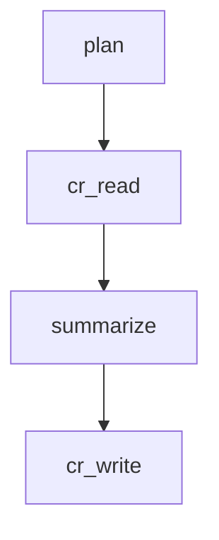

# 데모 실행 가이드

## 🎬 해커톤 데모 스크립트

### 데모 전 체크리스트
- [ ] uv 설치 및 의존성 설치 완료 (`uv sync`)
- [ ] 포트 8001, 8002, 8003 사용 가능
- [ ] 데모 데이터 준비 (선택사항)
- [ ] 브라우저에서 http://localhost:8003 열기

### 데모 플로우 (15분)

## 1. 소개 (2분)

**"현대적인 AI 통합 패턴을 보여주는 AI Agent Orchestrator를 구축했습니다."**

### 아키텍처 개요
```
Client Layer (AI Apps) → MCP Server → Agent Orchestrator → Context Registry
                                    ↓
                              Backoffice UI
```

**핵심 기술:**
- **MCP Protocol**: 클라이언트 독립적 AI 통신
- **LangGraph**: 상태 기반 에이전트 워크플로우
- **SQLite**: 영구 컨텍스트 저장소
- **FastAPI**: 웹 인터페이스 및 API

## 2. 시스템 시작 (2분)

### 데모 시작
```bash
cd ai-prompt-history-llama
uv run python start_demo.py
```

**예상 출력:**
```
AI Agent Orchestrator 데모 시작
Context Registry 시작 중...
Context Registry가 PID 1234로 시작됨
Agent Orchestrator 시작 중...
Agent Orchestrator가 PID 1235로 시작됨
MCP Server 시작 중...
MCP Server가 PID 1236으로 시작됨
Backoffice UI 시작 중...
Backoffice UI가 PID 1237로 시작됨
모든 컴포넌트가 성공적으로 시작됨!
데모 URL:
- Backoffice UI: http://localhost:8003
```

### 컴포넌트 확인
- http://localhost:8003 열기
- 통계가 포함된 대시보드 보여주기
- UI 네비게이션 설명

## 3. MCP 툴 데모 (4분)

### 툴 1: 대화 로깅

**MCP 클라이언트 호출 시뮬레이션:**
```python
# Claude Desktop, Cursor 등에서 호출되는 방식
conversation_log(
    session_id="demo_session_001",
    user_message="마이크로서비스를 구현하는 가장 좋은 방법은 무엇인가요?",
    assistant_response="마이크로서비스는 명확한 경계, 독립적인 배포, 적절한 모니터링으로 구현하는 것이 가장 좋습니다. 주요 패턴으로는 API 게이트웨이, 서비스 디스커버리, 이벤트 기반 통신이 있습니다.",
    platform="claude",
    metadata="{\"topic\": \"architecture\", \"complexity\": \"intermediate\"}"
)
```

**플로우 보여주기:**
1. MCP Server가 호출을 받음
2. Agent Orchestrator가 StateGraph를 통해 처리
3. Context Registry에 대화 저장
4. Backoffice UI가 즉시 업데이트

### 툴 2: 콘텐츠 추출

**추출 호출 시뮬레이션:**
```python
extract(
    content="우리 팀 회의에서는 세 가지 주요 영역을 다뤘습니다: 50만 달러 할당을 포함한 Q4 예산 계획, 3명의 새로운 엔지니어 추가를 위한 팀 구조 조정, 그리고 2024년 3월 신제품 출시 일정. 액션 아이템으로는 금요일까지 예산 검토, 다음 주 채용 공고 게시, 월말까지 제품 사양 확정이 있습니다.",
    extract_type="action_items",
    context="{\"meeting_type\": \"quarterly_planning\"}"
)
```

**결과 시연:**
- backoffice에서 구조화된 추출 결과 보여주기
- 신뢰도 점수 강조
- 컨텍스트 통합 설명

## 4. Agent Orchestrator 워크플로우 (3분)

### LangGraph StateGraph 플로우

**4노드 워크플로우 설명:**



1. **Plan Node**: 요청 타입을 분석하고 전략 생성
2. **CR Read Node**: 레지스트리에서 관련 컨텍스트 조회
3. **Summarize Node**: 컨텍스트 통합으로 콘텐츠 처리
4. **CR Write Node**: 결과를 레지스트리에 저장

### 상태 관리 보여주기
```python
class AgentState(TypedDict):
    request_type: str
    content: Dict[str, Any]
    plan: Optional[Dict[str, Any]]
    context_data: Optional[Dict[str, Any]]
    summary_result: Optional[Dict[str, Any]]
    final_result: Optional[Dict[str, Any]]
```

## 5. Context Registry 심층 분석 (2분)

### 데이터베이스 스키마
**세 개의 핵심 테이블 보여주기:**

1. **conversation**: 사용자-어시스턴트 상호작용
2. **extract_result**: 처리된 추출 결과  
3. **action_log**: 시스템 활동 추적

### UI에서 데이터 브라우징
- /conversations로 이동
- 플랫폼 필터링 보여주기
- 타입 필터링으로 /extracts 표시
- 관리 기능을 위한 /jobs 검토

### API 엔드포인트
```bash
# 데모 중 라이브 API 호출
curl http://localhost:8003/api/stats
curl http://localhost:8003/api/conversations
curl http://localhost:8003/api/extracts
```

## 6. 클라이언트 통합 (1분)

### MCP 클라이언트 설정

**설정 예시 보여주기:**

**Claude Desktop:**
```json
{
  "mcpServers": {
    "ai-agent-orchestrator": {
      "command": "uv",
      "args": ["run", "python", "mcp_server/server.py"]
    }
  }
}
```

**Cursor IDE:**
```json
{
  "mcp": {
    "servers": {
      "ai-agent-orchestrator": {
        "command": "uv",
        "args": ["run", "python", "mcp_server/server.py"]
      }
    }
  }
}
```

## 7. 잡 관리 데모 (1분)

### Daily Digest 기능
- backoffice에서 /jobs로 이동
- 예약된 daily digest (07:00 KST) 보여주기
- 수동 실행 트리거
- 생성된 digest 결과 표시

### 백그라운드 처리
```bash
# daily digest 트리거
curl -X POST http://localhost:8003/api/jobs/daily-digest/trigger
```

## 데모 Q&A 준비

### 기술적 질문

**Q: MCP가 기존 API와 어떻게 다른가요?**
A: MCP는 AI 클라이언트와 툴 간의 표준화된 통신을 제공하며, stdio와 HTTP 전송을 모두 지원하고 내장된 툴 발견 기능이 있습니다.

**Q: 오케스트레이터에 LangGraph를 사용하는 이유는?**
A: LangGraph는 상태 관리와 워크플로우 오케스트레이션을 제공하여 복잡한 AI 에이전트 동작을 더 유지보수 가능하고 디버깅 가능하게 만듭니다.

**Q: Context Registry는 어떻게 데이터 일관성을 보장하나요?**
A: WAL 모드의 SQLite, 적절한 트랜잭션, 외래 키 제약이 있는 구조화된 스키마를 사용합니다.

**Q: 데모를 넘어서서 확장할 수 있나요?**
A: 네, 컴포넌트를 컨테이너화하고, 데이터베이스를 PostgreSQL로 교체하며, 수평적 확장을 추가할 수 있습니다.

### 아키텍처 질문

**Q: 여러 AI 클라이언트를 동시에 어떻게 처리하나요?**
A: MCP 서버는 동시 연결을 지원하며, 에이전트 오케스트레이터는 병렬 요청 처리를 위해 비동기 처리를 사용합니다.

**Q: 컴포넌트가 실패하면 어떻게 되나요?**
A: 각 컴포넌트는 (Context Registry 제외) 상태가 없도록 설계되어 재시작이 깔끔합니다. 오류 처리에는 우아한 성능 저하가 포함됩니다.

**Q: 프라이버시는 어떻게 보장되나요?**
A: 모든 처리가 로컬에서 이루어지고, 민감한 데이터에 대한 외부 API 호출이 없으며, Context Registry는 저장 시 암호화될 수 있습니다.

## 데모 중 문제 해결

### 일반적인 문제

**포트가 이미 사용 중:**
```bash
# 프로세스 찾고 종료
lsof -ti:8003 | xargs kill -9
uv run python start_demo.py
```

**데이터베이스 락 오류:**
```bash
# Context Registry 재시작
uv run python context_registry/registry.py
```

**MCP 연결 실패:**
```bash
# 서버 상태 확인
ps aux | grep "server.py"
# 필요시 재시작
uv run python mcp_server/server.py
```

**UI 로딩 안됨:**
```bash
# FastAPI 서버 확인
curl http://localhost:8003/api/stats
# JSON 응답이 반환되어야 함
```

## 데모 후 리소스

### 관심 있는 참석자를 위해
- GitHub 저장소 링크
- 아키텍처 문서
- 로컬 개발을 위한 설정 지침
- 추가 개발을 위한 확장 아이디어

### 데모 산출물
- 데모에서 생성된 대화 로그
- 생성된 추출 결과
- 시스템 통계 및 성능 데이터
- 클라이언트 설정 예시

---

**기억하세요**: 이것은 현대적인 AI 통합 패턴의 실제 작동 시연입니다. 단순한 기능이 아닌 아키텍처에 초점을 맞춥니다!