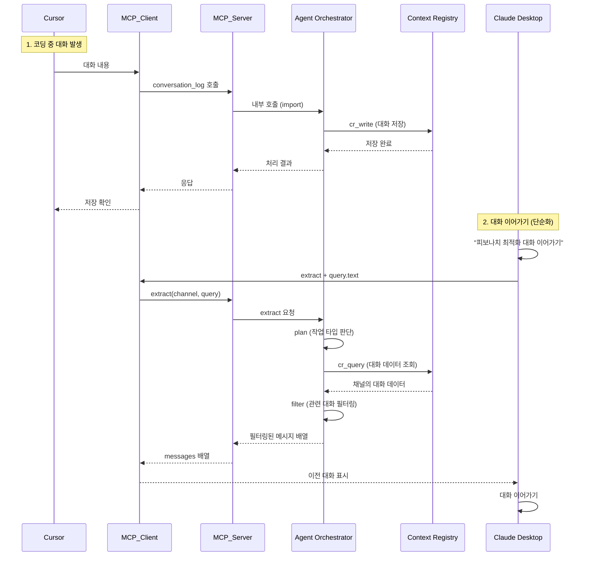

# Cursor → Claude Desktop 대화 연속성 인터페이스 정의서

## 📋 시나리오 개요

### 시나리오명
**Cursor에서 Claude로 이어가기 (Cross-Platform Conversation Continuity)**

### 목적
Cursor에서 코딩 작업 중 나눈 AI 대화를 Claude Desktop에서 조회하여 이어서 진행할 수 있도록 하는 기능

### 핵심 요구사항
- Cursor에서 발생한 대화를 Context Registry에 자동 저장
- Claude Desktop에서 동일한 채널의 대화 이력 조회
- 채널 ID를 통한 대화 연속성 보장
- 실시간 동기화 지원

---

## 🔄 전체 데이터 플로우



### Cursor Rules 설정 (자동 로깅 활성화)

**System Prompt 예시**
```markdown
# Cursor Rules for Conversation Logging

매 턴마다 대화가 끝나면 conversation_log 툴을 호출하여 대화를 저장하세요.

## 호출 예시
```json
{
  "tool": "conversation_log",
  "parameters": {
    "channel": "cursor_session_20250929_1430",
    "messages": [
      // 현재 대화의 모든 메시지
    ],
    "meta": {}
  }
}
```

### 상세 단계별 설명

1. **Cursor에서 대화 발생**
   - 사용자가 Cursor에서 코딩 관련 질문/답변 진행
   - Cursor Rules (System Prompt)가 대화 종료 시 conversation_log 툴 호출을 지시
   - MCP Client는 툴 호출을 MCP Server로 전달하는 역할

2. **대화 저장 (conversation_log)**
   - MCP Server의 conversation_log 툴 호출
   - Agent Orchestrator의 plan → cr_write 플로우 실행
   - Context Registry에 채널별로 저장

3. **Claude Desktop에서 조회 요청**
   - 사용자가 Claude Desktop에서 특정 내용의 대화 요청
   - query.text를 포함한 조회 요청 (예: "피보나치 최적화 관련 대화")

4. **대화 조회 (extract) - 단순화된 플로우**
   - MCP Server의 extract 툴 호출 (query.text 포함)
   - Agent Orchestrator의 범용 플로우:
     - plan → cr_query (대화 데이터 조회)
     - → filter (관련 대화 필터링)
     - → messages 배열 반환

5. **대화 이어가기**
   - Claude Desktop에 이전 대화 내용 표시
   - 사용자가 컨텍스트를 유지하며 대화 계속

---

## 🔧 요소기술별 인터페이스 정의

### 1. MCP Server (담당: 이지민님, 이재범님)

#### 1.1 conversation_log 툴

**목적**: Cursor에서 발생한 대화를 Context Registry에 저장

**입력 (Request)**
```json
{
  "tool": "conversation_log",
  "parameters": {
    "channel": "cursor_session_20250929_1430",
    "messages": [
      {
        "role": "user",
        "text": "이 함수의 시간복잡도를 개선하려면 어떻게 해야 할까요?",
        "timestamp": "2025-09-29T14:30:15.123Z"
      },
      {
        "role": "assistant",
        "text": "현재 O(n²)의 시간복잡도를 가진 이 함수는 해시맵을 사용하여 O(n)으로 개선할 수 있습니다...",
        "timestamp": "2025-09-29T14:30:18.456Z"
      }
    ],
    "meta": {
      "source": "cursor",
      "project": "ai-agent-orchestrator",
      "file": "src/utils/optimizer.py",
      "language": "python",
      "additional_context": {
        "current_function": "optimize_search",
        "line_number": 145
      }
    }
  }
}
```

**출력 (Response)**
```json
{
  "ok": true,
  "tool": "conversation_log",
  "result": {
    "stored_ids": ["conv_001", "conv_002"],
    "channel": "cursor_session_20250929_1430",
    "message_count": 2,
    "timestamp": "2025-09-29T14:30:20.789Z"
  }
}
```

**에러 응답 (공통)**
```json
{
  "ok": false,
  "tool": "extract",
  "error": {
    "code": "NOT_FOUND",
    "message": "No matching conversations found",
    "details": "No conversations found for query: '피보나치 함수 시간복잡도 개선'"
  }
}
```

#### 1.2 extract 툴

**목적**: Claude Desktop에서 저장된 대화를 컨텍스트와 함께 조회하여 대화 이어가기

**입력 (Request)**
```json
{
  "tool": "extract",
  "parameters": {
    "channel": "cursor_session_20250929_1430",
    "query": {
      "text": "피보나치 함수 시간복잡도 개선 관련 대화",
      "limit": 20
    },
    "meta": {
      "source": "claude"
    }
  }
}
```

**주요 필드 설명**
- `query.text`: 찾고자 하는 대화의 내용을 설명하는 자연어 쿼리
- `query.limit`: 반환할 메시지 수 제한 (Optional)
- 불필요한 필드들 제거로 단순화

**출력 (Response)**
```json
{
  "ok": true,
  "tool": "extract",
  "result": {
    "channel": "cursor_session_20250929_1430",
    "messages": [
      {
        "role": "user",
        "text": "이 함수의 시간복잡도를 개선하려면 어떻게 해야 할까요?",
        "timestamp": "2025-09-29T14:30:15.123Z",
        "context": {
          "file": "src/utils/optimizer.py",
          "line": 145
        }
      },
      {
        "role": "assistant",
        "text": "현재 O(2^n)의 시간복잡도를 가진 재귀 피보나치는 동적 프로그래밍으로 개선 가능합니다. 메모이제이션을 사용하면 O(n) 시간, O(n) 공간으로 최적화되며, 반복문과 두 변수만 사용하면 공간복잡도까지 O(1)로 줄일 수 있습니다.",
        "timestamp": "2025-09-29T14:30:18.456Z"
      },
      {
        "role": "user",
        "text": "메모리 사용량도 O(1)로 줄일 수 있을까요?",
        "timestamp": "2025-09-29T14:35:10.789Z"
      },
      {
        "role": "assistant",
        "text": "네, 두 개의 변수만 사용하여 이전 두 값을 저장하는 방식으로 공간복잡도를 O(1)로 최적화할 수 있습니다.",
        "timestamp": "2025-09-29T14:35:22.789Z"
      }
    ],
    "metadata": {
      "total_messages": 8,
      "filtered_messages": 4,
      "last_activity": "2025-09-29T14:35:22.789Z"
    }
  }
}
```

**필드 설명**
- `messages`: 조회된 대화 메시지 배열 (원본 형태)
- `metadata`: 조회 결과에 대한 추가 정보 (Optional)
- 모든 mode 구분 제거 - 단일 형태로 통일

---

### 2. Agent Orchestrator (담당: 최현님)

#### 2.1 범용 StateGraph 노드 구성

**다중 시나리오 지원을 위한 범용 노드**
```python
# 범용 State 정의
class GeneralState(TypedDict):
    operation: str  # "extract" | "daily_briefing" | "conversation_log"
    source: str  # 데이터 출처
    channel: Optional[str]  # 대화 채널 (필요시)
    query: Optional[Dict]  # 쿼리 데이터
    data: Optional[List]  # 조회된 데이터
    transformed_data: Optional[Any]  # 변환된 데이터
    result: Optional[Any]  # 최종 결과
    error: Optional[str]  # 에러 메시지

# 범용 노드 구성
1. plan 노드
   - 입력: operation 타입 확인
   - 판단: 수행할 작업 유형 결정
   - 다음: 작업에 따라 적절한 노드로 라우팅

2. cr_query 노드
   - 입력: 쿼리 조건 (channel, query, 데이터 타입)
   - 처리: CR에서 데이터 조회 (대화, Notion 데이터 등)
   - 출력: 조회된 데이터 목록

3. filter 노드
   - 입력: 조회된 데이터 + 필터 조건
   - 처리: 조건에 맞는 데이터 필터링
   - 출력: 필터링된 데이터

4. transform 노드
   - 입력: 데이터 + 변환 타입
   - 처리: 데이터 변환 (요약, 브리핑 생성 등)
   - 출력: 변환된 데이터

5. cr_write 노드
   - 입력: 저장할 데이터
   - 처리: CR에 데이터 저장
   - 출력: 저장 결과 ID

6. external_action 노드
   - 입력: 외부 액션 데이터
   - 처리: 외부 시스템 호출 (Notion MCP 등)
   - 출력: 액션 수행 결과
```

**입력 (MCP Server → AO)**
```python
{
    "operation": "save",
    "channel": "cursor_session_20250929_1430",
    "messages": [...],
    "source": "cursor",
    "metadata": {...}
}
```

**출력 (AO → MCP Server)**
```python
{
    "success": True,
    "stored_ids": ["conv_001", "conv_002"],
    "timestamp": "2025-09-29T14:30:20.789Z"
}
```

#### 2.2 시나리오별 플로우 예시

**1. Extract 플로우 (Cursor → Claude 대화 조회)**
```python
# 플로우: plan → cr_query → filter → (결과 반환)
operation = "extract"
1. plan: extract 작업 확인 → cr_query로 라우팅
2. cr_query: channel의 대화 데이터 조회
3. filter: query.text로 관련 대화 필터링
4. 결과: messages 배열 반환
```

**2. Daily Briefing 플로우 (Notion 데이터 요약 → 브리핑 생성)**
```python
# 플로우: plan → cr_query → transform → external_action → cr_write
operation = "daily_briefing"
1. plan: daily_briefing 작업 확인 → cr_query로 라우팅
2. cr_query: 어제 날짜의 Notion 데이터 조회
3. transform: LLaMA로 데일리 브리핑 생성
4. external_action: Notion MCP로 브리핑 페이지 생성
5. cr_write: 실행 로그 저장
```

**3. Conversation Log 플로우 (대화 저장)**
```python
# 플로우: plan → cr_write
operation = "conversation_log"
1. plan: conversation_log 작업 확인 → cr_write로 라우팅
2. cr_write: 대화 데이터 저장
```

**입력 (MCP Server → AO) - Extract 요청**
```python
{
    "operation": "extract",
    "channel": "cursor_session_20250929_1430",
    "query": {
        "text": "피보나치 함수 시간복잡도 개선 관련 대화",
        "limit": 20
    },
    "source": "claude"
}
```

**출력 (AO → MCP Server) - Extract 결과**
```python
{
    "success": True,
    "messages": [
        {
            "role": "user",
            "text": "이 함수의 시간복잡도를 개선하려면 어떻게 해야 할까요?",
            "timestamp": "2025-09-29T14:30:15.123Z"
        },
        {
            "role": "assistant", 
            "text": "현재 O(2^n)의 시간복잡도를 가진 재귀 피보나치는...",
            "timestamp": "2025-09-29T14:30:18.456Z"
        }
    ],
    "metadata": {
        "total_count": 8,
        "filtered_count": 4
    }
}
```

**입력 (Backoffice → AO) - Daily Briefing 요청**
```python
{
    "operation": "daily_briefing",
    "query": {
        "date": "2025-09-28",
        "data_types": ["notion_snapshots", "conversation_summaries"]
    },
    "source": "backoffice"
}
```

---

### 3. Context Registry (담당: 이지민님, 이재범님)

#### 3.1 데이터 스키마

**conversation 테이블**
```sql
CREATE TABLE conversation (
    id TEXT PRIMARY KEY,
    record_type TEXT DEFAULT 'conversation',
    source TEXT NOT NULL,  -- 'cursor' | 'claude' | 'chatgpt' | 'gemini'
    channel TEXT NOT NULL,
    payload JSON NOT NULL,  -- messages array
    timestamp DATETIME DEFAULT CURRENT_TIMESTAMP,
    actor TEXT DEFAULT 'ao',
    deleted BOOLEAN DEFAULT FALSE,
    
    INDEX idx_channel (channel),
    INDEX idx_source (source),
    INDEX idx_timestamp (timestamp)
);
```

**extract_result 테이블**
```sql
CREATE TABLE extract_result (
    id TEXT PRIMARY KEY,
    record_type TEXT DEFAULT 'extract_result',
    channel TEXT NOT NULL,
    result_type TEXT NOT NULL,  -- 'raw' | 'summary' | 'digest'
    items JSON NOT NULL,
    metadata JSON,
    timestamp DATETIME DEFAULT CURRENT_TIMESTAMP,
    deleted BOOLEAN DEFAULT FALSE
);
```

#### 3.2 저장 API

**함수 시그니처**
```python
async def save_conversation(
    channel: str,
    messages: List[Dict],
    source: str,
    metadata: Optional[Dict] = None
) -> List[str]:
    """
    대화를 Context Registry에 저장
    
    Returns:
        저장된 레코드 ID 목록
    """
```

#### 3.3 조회 API

**함수 시그니처**
```python
async def get_conversations(
    channel: str,
    limit: int = 20,
    from_timestamp: Optional[datetime] = None,
    to_timestamp: Optional[datetime] = None,
    include_deleted: bool = False
) -> List[Dict]:
    """
    채널별 대화 조회
    
    Returns:
        대화 메시지 목록
    """
```

---

### 4. Backoffice (담당: 황중원님)

#### 4.1 Registry Viewer

**대화 이력 모니터링 UI**
- 채널별 대화 목록 표시
- 소스(Cursor/Claude) 필터링
- 시간대별 조회
- 대화 상세 내용 보기

**필요한 API 엔드포인트**
```
GET /bo/conversations?channel={channel}&source={source}&from={timestamp}&to={timestamp}
GET /bo/conversations/{id}
DELETE /bo/conversations/{id}?soft=true
```

#### 4.2 Agent Flow Monitor

**플로우 실행 모니터링**
- conversation_log 호출 추적
- extract 호출 추적
- 성공/실패 통계
- 응답 시간 측정

**필요한 API 엔드포인트**
```
GET /bo/ao/executions?operation={save|retrieve}&channel={channel}
GET /bo/ao/executions/{execution_id}
GET /bo/ao/statistics?from={date}&to={date}
```

---

## 📦 메시지 포맷 규약

### 공통 필드 정의

| 필드명 | 타입 | 필수 | 설명 |
|--------|------|------|------|
| channel | string | ✅ | 대화 채널 식별자 (세션 ID) |
| source | string | ✅ | 요청 출처 (cursor\|claude\|chatgpt\|gemini) |
| timestamp | ISO8601 | ✅ | 타임스탬프 |
| meta | object | ❌ | 추가 메타데이터 |

### 메시지 구조

```typescript
interface Message {
  role: 'user' | 'assistant' | 'system';
  text: string;
  timestamp: string;  // ISO8601
  context?: {
    file?: string;
    line?: number;
    language?: string;
    [key: string]: any;
  };
}
```

### 에러 코드 정의

| 코드 | 설명 | HTTP 상태 |
|------|------|-----------|
| STORAGE_ERROR | CR 저장 실패 | 500 |
| NOT_FOUND | 채널/대화 없음 | 404 |
| INVALID_REQUEST | 잘못된 요청 형식 | 400 |
| UNAUTHORIZED | 인증 실패 | 401 |
| TIMEOUT | 처리 시간 초과 | 504 |

---

## ✅ 구현 체크리스트

### MCP Server (이지민님, 이재범님)
- [ ] conversation_log 툴 구현
  - [ ] 요청 파싱 및 검증
  - [ ] Agent Orchestrator 호출
  - [ ] 응답 포맷팅
- [ ] extract 툴 구현
  - [ ] 쿼리 파라미터 처리
  - [ ] raw/summary 모드 분기 (기본적으로 관련 메시지 전체를 전달하는 raw모드만 구현 예정)
  - [ ] 페이징 지원 (optional)
- [ ] 에러 핸들링 (위 정의된 세부적인 종류말고 success/fail 정도만 처리되면 될듯합니다)
- [ ] 로깅 시스템 (간단히 서버로그 저장되면 되지 않을까 합니다)

### Agent Orchestrator (최현님) - todo사항들은 mock이니까 최현님 생각하시는 방향이 있다면 그것대로 구현하시면 됩니다.(입출력만 정의해드린 대로 나오면 됩니다)
- [ ] StateGraph 정의
  - [ ] ConversationState 타입 정의
  - [ ] 노드 구현 (plan, cr_read, cr_write, summarize)
  - [ ] 엣지 및 라우팅 로직
- [ ] CR 연동
  - [ ] 저장 플로우
  - [ ] 조회 플로우
- [ ] LLaMA 통합 (요약 기능)

### Context Registry (이지민님, 이재범님) - 마찬가지로 입출력만 정의해드린대로 나오면되니 생각하시는 방향대로 편하게 작업해주세요.
- [ ] 데이터베이스 스키마 생성
- [ ] CRUD API 구현
  - [ ] save_conversation
  - [ ] get_conversations
  - [ ] delete_conversation (soft delete)
- [ ] 인덱싱 및 성능 최적화
- [ ] 채널 관리 로직

### Backoffice (황중원님)
- [ ] Registry Viewer UI
  - [ ] 대화 목록 페이지
  - [ ] 대화 상세 페이지
  - [ ] 필터/검색 기능
- [ ] Agent Flow Monitor
  - [ ] 실행 이력 페이지
  - [ ] 통계 대시보드
- [ ] API 클라이언트 구현

---

## 🧪 테스트 시나리오

### 시나리오 1: 기본 대화 저장 및 조회
1. Cursor에서 3턴의 대화 생성
2. conversation_log 툴로 저장
3. Claude Desktop에서 extract 툴로 조회
4. 동일한 대화 내용 확인

### 시나리오 2: 대량 대화 처리
1. 50개 이상의 메시지 저장
2. 페이징을 통한 조회
3. 성능 측정 (응답 시간 < 1초)

### 시나리오 3: 에러 처리
1. 잘못된 채널 ID로 조회
2. CR 연결 실패 상황 시뮬레이션
3. 타임아웃 처리 확인

### 시나리오 4: 동시성 테스트
1. 여러 Cursor 세션에서 동시 저장
2. 채널별 격리 확인
3. 데이터 일관성 검증

---

## 📅 예상 일정

| 단계 | 작업 내용 | 담당자 | 예상 시간 |
|------|----------|--------|-----------|
| 1 | CR 스키마 및 API | 이지민, 이재범 | 2시간 |
| 2 | Agent Orchestrator 플로우 | 최현 | 2시간 |
| 3 | MCP Server 툴 구현 | 이지민, 이재범 | 3시간 |
| 4 | Backoffice UI | 황중원 | 2시간 |
| 5 | 통합 테스트 | 전체 | 1시간 |
| 6 | 버그 수정 및 최적화 | 전체 | 1시간 |

**총 예상 시간**: 11시간 (여유 시간 포함)

---

## 📌 주의사항

1. **채널 ID 관리**
   - 채널 ID는 세션별로 유니크해야 함
   - 형식: `{source}_session_{timestamp}`
   - 예: `cursor_session_20250929_1430`

2. **메시지 순서 보장**
   - timestamp 기준 정렬 필수
   - 동일 시간대 메시지는 입력 순서 유지

3. **보안 고려사항**
   - 민감한 코드 정보 필터링 (향후 구현)
   - 채널별 접근 권한 검증 (향후 구현)

4. **성능 최적화**
   - 대량 메시지 처리 시 배치 저장
   - 조회 시 캐싱 활용 (optional)
   - 불필요한 데이터 전송 최소화

---

## 🔗 참고 자료

- [MCP Specification](https://modelcontextprotocol.io/)
- [LangGraph Documentation](https://python.langchain.com/docs/langgraph)
- [프로젝트 전체 아키텍처](../README.md)
- [프로젝트 기획서](./PROJECT_SPECIFICATION.md)